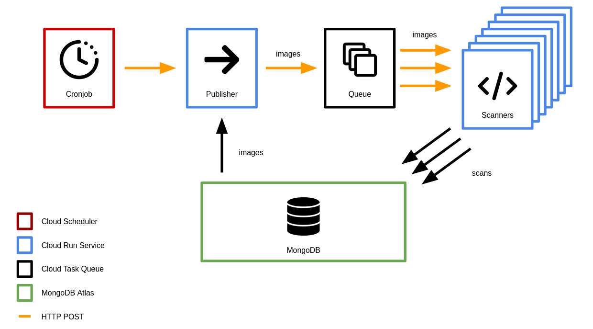

# chainguard-gallery (Power Hour)

### Overview
---
Chainguard Gallery is a distributed system for container image scanning at scale. Gallery is designed for Google Cloud and performs regular scans at an hourly interval using [grype](https://github.com/anchore/grype).
The following data is collected per scan:

| Param        | Details                     |
| --------     | -------                     |
| scan_start   | UTC start time of the scan  |
| scan_duration| Duration of the scan        |
| cves         | List of CVEs found by grype |
| registry     | Iamge registry              |
| repository   | Image repository name       |
| tag          | Image tag                   |
| labels       | Comma-separated labels to group images |

Gallery's cloud architecture relies on scalable instances of Cloud Run preloaded with grype to perform scans. Every hour, a Cloud Scheduler triggers the scan routine which proceeds as follows:

1) Cloud Scheduler sends a request to a Cloud Run Instance called the *Publisher*. The Publisher pulls the list of images to scan from a MongoDB database and adds them to a Cloud Task Queue.
2) Another Cloud Run service called the *Scanner* spins up in response to the queued tasks. Each Scanner is preloaded with grype and pulls one image at a time from the queue, scans the image, and pushes the results to MongoDB.
3) As the queue continuess to fill, the Scanner service scales to process images swiftly in parallel. Scanning continues until the queue is empty.

